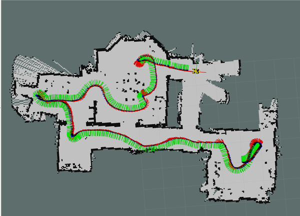

# Spot Micro Quadruped Project
Great work @mike4192

Modified from:
https://github.com/mike4192/spotMicro


This is a fork of the original @mike4192 project, upgraded to work will ROS NOETIC and UBUNTU 20.04
___________________________
##  NOETIC version

Version for UBUNTU 20.4 and ROS NOETIC, both of them LTS version, **with support until 2025**.
Furthermore, NOETIC uses python 3 by default, once python 2.7 is deprecated.


**UBUNTU 20.4 64 bits (desktop / raspberry pi (server version))**

### INSTALL ROS NOETIC UBUNTU 20.4 64 bits
http://wiki.ros.org/noetic/Installation/Ubuntu

**NOTE**  use ros-noetic-base option
```
sudo apt install ros-noetic-ros-base

```
##### Installed directory:
```
mkdir mobile_ws
cd mobile_ws
mkdir src
cd src
git clone https://github.com/UKMFKABRR/spotMicro
```

```
mobile_ws/
│
├── src/
	│   spotMicro
│		├── spot_micro_motion_cmd
│   	 		└── ...
│  		├── spot_micro_keyboard_cmd
│   	│   		└── ...  
│   		└── ...
```

##### Additional packages
```
sudo apt install python3-catkin python3-catkin-pkg python3-catkin-pkg-modules python3-catkin-tools
sudo apt install libi2c-dev i2c-tools python3-smbus python3-rpi.gpio
sudo apt install qtbase5-dev
sudo apt install ros-noetic-tf2-eigen ros-noetic-tf2-ros
sudo apt install ros-noetic-joy
sudo apt install ros-noetic-hector-slam

```

#### ROSI2C

##### Some change before compile (NO NEED TO DO THIS)

Add i2c into line 22 of src/ros-i2cpwmboard/CMakeLists.txt, so that it looks like:
```
target_link_libraries(i2cpwm_board ${catkin_LIBRARIES} i2c)
```

And add the code below to src/ros-i2cpwmboard/src/i2cpwm_controller.cpp:
```
extern "C" {
	#include <i2c/smbus.h>
}
```
##### Compile with catkin_tools
```
cd ~/mobile_ws
catkin_make -DCMAKE_BUILD_TYPE=Release
```
##### Compile results
```
[  0%] Built target _i2cpwm_board_generate_messages_check_deps_ServoConfigArray
[  0%] Built target _i2cpwm_board_generate_messages_check_deps_DriveMode
[  0%] Built target _i2cpwm_board_generate_messages_check_deps_PositionArray
[  0%] Built target _i2cpwm_board_generate_messages_check_deps_StopServos
[  0%] Built target std_msgs_generate_messages_cpp
[  0%] Built target _i2cpwm_board_generate_messages_check_deps_Position
[  0%] Built target _i2cpwm_board_generate_messages_check_deps_Servo
[  0%] Built target _i2cpwm_board_generate_messages_check_deps_ServosConfig
[  0%] Built target std_msgs_generate_messages_py
[  0%] Built target _i2cpwm_board_generate_messages_check_deps_ServoArray
[  0%] Built target std_msgs_generate_messages_nodejs
[  0%] Built target std_msgs_generate_messages_eus
[  0%] Built target _i2cpwm_board_generate_messages_check_deps_ServoConfig
[  0%] Built target _i2cpwm_board_generate_messages_check_deps_IntValue
[  0%] Built target std_msgs_generate_messages_lisp
[  5%] Built target spot_micro_kinematics
[  7%] Built target gtest
[ 20%] Built target i2cpwm_board_generate_messages_cpp
[ 35%] Built target i2cpwm_board_generate_messages_py
[ 61%] Built target i2cpwm_board_generate_messages_nodejs
[ 61%] Built target i2cpwm_board_generate_messages_eus
[ 73%] Built target i2cpwm_board_generate_messages_lisp
[ 76%] Built target gtest_main
[ 85%] Built target smfsm
[ 87%] Built target i2cpwm_board
[ 87%] Built target i2cpwm_board_generate_messages
[ 90%] Built target test_spot_micro_leg
[ 92%] Built target test_spot_micro_kinematics
[ 95%] Built target test_utils
[100%] Built target spot_micro_motion_cmd_node

```

##### ADD ubuntu user to i2c group 
(depends to username you used)
```
sudo usermod -a -G i2c ubuntu
logout
```
###### Test i2c access 

run `i2cdetect -y 1` as ubuntu user

Expected output below
```
     0  1  2  3  4  5  6  7  8  9  a  b  c  d  e  f
00:          -- -- -- -- -- -- -- -- -- -- -- -- -- 
10: -- -- -- -- -- -- -- -- -- -- -- -- -- -- -- -- 
20: -- -- -- -- -- -- -- -- -- -- -- -- -- -- -- -- 
30: -- -- -- -- -- -- -- -- -- -- -- -- -- -- -- -- 
40: 40 -- -- -- -- -- -- -- -- -- -- -- -- -- -- -- 
50: -- -- -- -- -- -- -- -- -- -- -- -- -- -- -- -- 
60: -- -- -- -- -- -- -- -- -- -- -- -- -- -- -- -- 

70: 70 -- -- -- -- -- -- --   
```

### READY TO COMPILE

https://github.com/mike4192/spotMicro


## Future Work

Incorporate a Intel realsense R300 to achieve 3D mapping via SLAM, to avoid obstacles, recognize hands commands and recognize faces.


## REFERENCE

#### NOETIC INSTALL - UBUNTU 20.4
http://wiki.ros.org/noetic/Installation/Ubuntu

#### MIGRATION TO NOETIC
http://wiki.ros.org/noetic/Migration

____________________________
### ORIGINAL PROJECT

https://github.com/mike4192/spotMicro




Video of robot: https://www.youtube.com/watch?v=S-uzWG9Z-5E


